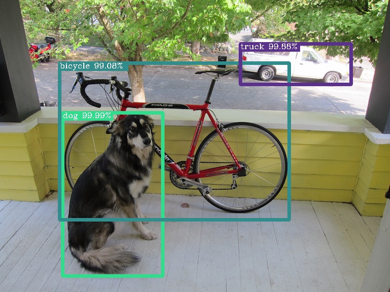

# KISS YOLOv3

**YOLOv3 in Tensorflow(TF-Slim)**

| python | tensorflow | opencv |
| :----: | :--------: | :----: |
| 3.6.5  |   1.8.0    | 3.3.1  |

The End Is Always Near.

- [x] **transformation Script**: Convert original [yolov3.weight](https://pjreddie.com/media/files/yolov3.weights) to Tensorflow style.
- [x] **Backbone**:  Inference is available.
- [ ] **Training operation**: Construction.
- [ ] ...

---

## Transformation

Download yolov3.weight and yolov3.cfg from the [Homepage](https://pjreddie.com/darknet/yolo/).

Run our script(you need Tensorflow, Numpy and Python3 only).

```python
from yoloparser import YoloParser

weights_path = "./yolov3/yolov3.weights"
cfg_path = "./yolov3/yolov3.cfg"
out_path = "./yolov3/yolov3.ckpt"

parser = YoloParser(cfg_path, weights_path, out_path)
parser.run()
```

```shell
Reading .cfg file ...
Converting ...
From ./yolov3/yolov3.weights
To   ./yolov3/yolov3.ckpt
Encode weights...
Success!
Model Parameters:
<tf.Variable 'Conv_0/weights:0' shape=(3, 3, 3, 32) dtype=float32_ref>
<tf.Variable 'Conv_0/BatchNorm/gamma:0' shape=(32,) dtype=float32_ref>
<tf.Variable 'Conv_0/BatchNorm/beta:0' shape=(32,) dtype=float32_ref>
<tf.Variable 'Conv_0/BatchNorm/moving_mean:0' shape=(32,) dtype=float32_ref>
<tf.Variable 'Conv_0/BatchNorm/moving_variance:0' shape=(32,) dtype=float32_ref>
<tf.Variable 'Conv_1/weights:0' shape=(3, 3, 32, 64) dtype=float32_ref>
<tf.Variable 'Conv_1/BatchNorm/gamma:0' shape=(64,) dtype=float32_ref>
<tf.Variable 'Conv_1/BatchNorm/beta:0' shape=(64,) dtype=float32_ref>
<tf.Variable 'Conv_1/BatchNorm/moving_mean:0' shape=(64,) dtype=float32_ref>
<tf.Variable 'Conv_1/BatchNorm/moving_variance:0' shape=(64,) dtype=float32_ref>
...
Finish !
```

You can check all variables by Tensorflow API. Of course,  renaming all variables is possible by tf.train.Saver.

```python
import tensorflow as tf

reader = tf.train.NewCheckpointReader(out_path)
var_to_shape_map = reader.get_variable_to_shape_map()
for key in var_to_shape_map:
  print( key)
```

```shell
Conv_15/weights
Conv_0/BatchNorm/beta
Conv_0/BatchNorm/gamma
Conv_27/BatchNorm/gamma
Conv_11/weights
Conv_57/BatchNorm/moving_mean
Conv_1/BatchNorm/gamma
Conv_56/BatchNorm/gamma
Conv_0/BatchNorm/moving_mean
Conv_7/BatchNorm/gamma
Conv_44/BatchNorm/moving_variance
Conv_0/weights
Conv_15/BatchNorm/beta
Conv_0/BatchNorm/moving_variance
...
```

---

## **Backbone**

```python
from yolov3 import backbone
import yolo_utils
import visual

# you can find all of them in ./yolov3
ckpt_path = "./yolov3/yolov3.ckpt"
coco_name_path = "./yolov3/coco.name"
dog_jpg_path = './yolov3/dog.jpg'
output_path = './yolov3/detection.jpg'
```

We test the program with minibatch(batch size=1), so the input is made firstly(A 4-D tensor, [Batch_size, Height, Width, Channel] ). Normalizing the pixel value is also necessary.

```python
img = cv2.imread(dog_jpg_path)
img_resized = cv2.resize(img, (416, 416))
img_rgb = cv2.cvtColor(img_resized, cv2.COLOR_BGR2RGB)
img_float = np.expand_dims(img_rgb/255., axis=0)
```

The process of detection is simple.

```python
inputs = tf.placeholder(tf.float32, [None, 416, 416, 3])
predictions = backbone(inputs, 80, is_training=False, scope='yolov3')
predictions = yolo_utils.detections_boxes(predictions)
# load weight
saver = yolo_utils.restore_saver()
coco_name = yolo_utils.load_coco_name(coco_name_path)

with tf.Session() as sess:
    saver.restore(sess, ckpt_path)
    predictions = sess.run(predictions, feed_dict={inputs: img_float})	
```

A simple visualization API is also provided.

```python
predictions = yolo_utils.non_max_suppression(predictions)
imgs = [img]
visual.vis(imgs, predictions, (416, 416), coco_name, output_path)
```




