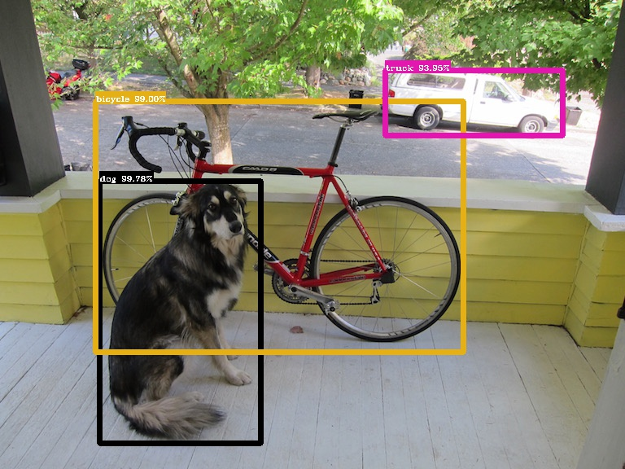
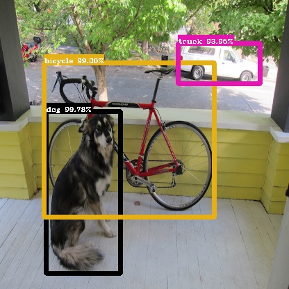

# YOLOv3

**YOLOv3 in TensorFlow(Keras)**

| Python | TensorFlow | OpenCV |
| :----: | :--------: | :----: |
| 3.7.6  |   2.0.0    | 3.4.2  |

Refactor All the Codes
- [x] **News**: TensorFlow 2.0 is available !
- [x] **Script**: Convert original [yolov3.weight](https://pjreddie.com/media/files/yolov3.weights) to Keras hdf5 style.
- [x] **Inference**:  Inference is available. 
- [ ] **Training**: Next Step.
- [ ] ...

---



## Transformation

Download yolov3.weight and yolov3.cfg from the [Homepage](https://pjreddie.com/darknet/yolo/).

Run the below command (you need TensorFlow, Numpy and Python only).

```shell
python convert.py --config=path/to/yolov3.cfg --weights=path/to/yolov3.cfg --output=path/to/yolov3.h5 
```

```shell
Reading .cfg file ...
Converting ...
From path/to/yolov3.weights
To   path/to/yolov3.h5
Encode weights...
Weights Header:  0 2 0 [32013312]
Success!
Model Parameters:
Finish !
```

---

## Inference

All of the hyper parameters about YoloV3 are defined in /yolov3/yolo/config.yaml.
```yaml
inference:
  iou_threshold: 0.5
  score_threshold: 0.5
  num_classes: 80
  max_boxes: 100

basic:
  weight_decay: 5e-4
  leaky_alpha: 0.1

  image_size: 416
  anchors: "10,13 16,30 33,23 30,61 62,45 59,119 116,90 156,198 373,326"
  mask: "6,7,8 3,4,5 0,1,2"
```

With the methods we have defined, visualizing the result is an easy work.

```python
import cv2
import numpy as np

from yolo.yolov3 import YoloV3
from dataset.paint import transform, draw_bboxes, load_names, assign_name_and_color

model = YoloV3()
model.summary()

model.load_weights("path/to/yolov3.h5")

names_list = load_names("./disc/coco.name")
img = img_raw = cv2.imread("./disc/dog.jpg")
img = cv2.resize(img, (416, 416))
img = cv2.cvtColor(img, cv2.COLOR_BGR2RGB)

# make a batch, batch_size = 1
imgs = np.expand_dims(img / 255., 0).astype(np.float32)

boxes, scores, classes, valid_detections = model.predict(imgs)

#  Canvas
## Invert
imgs = imgs[..., ::-1]
imgs *= 255
imgs = imgs.astype(np.uint8)

for img, box, score, cls, valid in zip(imgs, boxes, scores, classes, valid_detections):
    valid_boxes = box[:valid]
    valid_score = score[:valid]
    valid_cls = cls[:valid]

    # Relative to Absolute
    bboxes = transform(valid_boxes, img.shape[1::-1])

    names, colors = [], []
    for idx in valid_cls:
        name, color = assign_name_and_color(int(idx), names_list)
        names.append(name)
        colors.append(color)

    img = draw_bboxes(img, bboxes, valid_score, names, colors)

    cv2.imshow('img', img)

    cv2.waitKey()
```



By the way, the output will be fixed to 416x416. If you want to keep the original size, all you need is the original image.

```python
#  Canvas
## Invert
# imgs = imgs[..., ::-1]
# imgs *= 255
# imgs = imgs.astype(np.uint8)
imgs = [img_raw]
```


