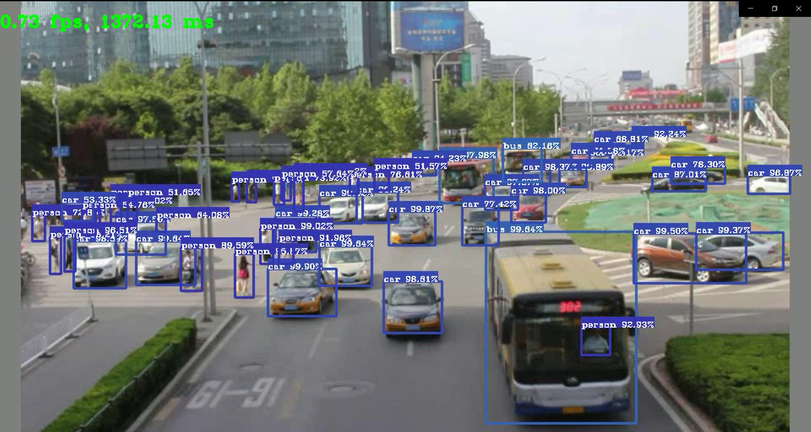
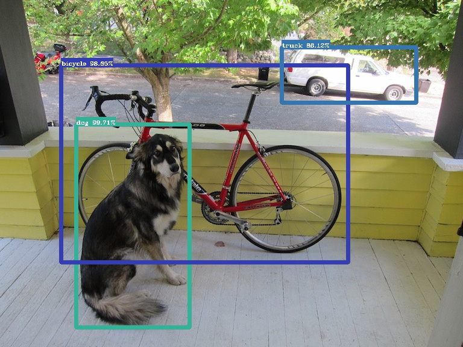

# YOLOv3

**YOLOv3 in TensorFlow(Keras)**

| Python | TensorFlow | OpenCV |
| :----: | :--------: | :----: |
| 3.7.6  |   2.0.0    | 3.4.2  |

Refactor All the Codes
- [x] **News**: TensorFlow 2.0 is available !
- [x] **Script**: 
  - [x] convert original yolov3.weight & yolov3.cfg to Keras style(hdf5).
  - [x] convert frames to a video
  - [x] not only image, but also video or web camera
- [x] **Core Components**:
  - [x] more easy api for inference
  - [x] reconstruct this project
- [ ] **Training**: Next Step.
  - [x] loss function is added (not test)
  - [x] simple data pipeline is available.
  - [ ] ...

---

## Script

### From yolov3.weights to yolov3.h5
Download yolov3.weight and yolov3.cfg from the [Homepage](https://pjreddie.com/darknet/yolo/).

Run the below command (you need TensorFlow, Numpy and Python only).

```shell script
python convert.py --config=path/to/yolov3.cfg --weights=path/to/yolov3.cfg --output=path/to/yolov3.h5 

or

python convert.py --tiny --config=path/to/yolov3-tiny.cfg --weights=path/to/yolov3-tiny.cfg --output=path/to/yolov3-tiny.h5 
```

```shell script
Reading .cfg file ...
Converting ...
From path/to/yolov3.weights
To   path/to/yolov3.h5
Encode weights...
Weights Header:  0 2 0 [32013312]
Success!
Model Parameters:
Finish !

or

Reading .cfg file ...
Converting ...
From path/to/yolov3-tiny.weights
To   path/to/yolov3-tiny.h5
Encode weights...
Weights Header:  0 2 0 [32013312]
Success!
Model Parameters:
Finish !
```

### From frame to video
XVID for MP4
```shell script
python pic2vid.py --src=path/to/frames --dst=path/to/video --fps=25 --format=XVID
```

### Scan a video or a web camera 

```shell script
python sensor.py --src=path/to/video(or device id) --dst=path/to/output --config=path/to/yolov3.config --tiny=False

or

python sensor.py --src=path/to/video(or device id) --dst=path/to/output --config=path/to/yolov3-tiny.config --tiny=True
```


---

## Core 

All of the hyper parameters about YoloV3 are defined in /yolov3/cfg
```yaml
# yolov3.yaml
yolo:
  iou_threshold: 0.45
  score_threshold: 0.3
  max_boxes: 100
  classes: "./disc/coco.name"
  strides: "32,16,8"

  anchors: "10,13 16,30 33,23 30,61 62,45 59,119 116,90 156,198 373,326"
  mask: "6,7,8 3,4,5 0,1,2"

train:
  annot_path: "disc/annotation.txt"
  image_size: "320,352,384,416,448,480,512,544,576,608"
  warmup_epoch: 2
  lr_init: 5e-3
  lr_end: 1e-6
  batch_size: 1
  num_epoch: 40
  init_weights: ""

  ignore_threshold: 0.7

test:
  image_size: "416"
  init_weights: "path/to/yolov3.h5"
```

With the methods we have defined, visualizing the result is an easy work.

```python
import cv2
import numpy as np

from yolo import config
from yolo.yolov3 import YoloV3
from tools.paint import draw_bboxes

cfg = config.load('cfg/yolov3.yaml')
names_list = cfg['yolo']['classes']

model = YoloV3(cfg)
model.summary()
model.load_weights(cfg['test']['init_weights'])

# define input
## image : RGB, float32
img = cv2.imread('./disc/dog.jpg')
img = cv2.cvtColor(img, cv2.COLOR_BGR2RGB)
imgs = np.expand_dims(img / 255., 0).astype(np.float32)

boxes, scores, classes, valid_detections = model.predict(imgs)

for img, box, score, cls, valid in zip(imgs, boxes, scores, classes, valid_detections):
    valid_boxes = box[:valid]
    valid_score = score[:valid]
    valid_cls = cls[:valid]

    img = draw_bboxes(img, valid_boxes, valid_score, valid_cls, names_list)

    cv2.imshow('img', img)
    cv2.waitKey()
```



---

## Others

Old TF-Slim version is [here](https://github.com/yuto3o/yolov3-tensorflow/tree/slim)

