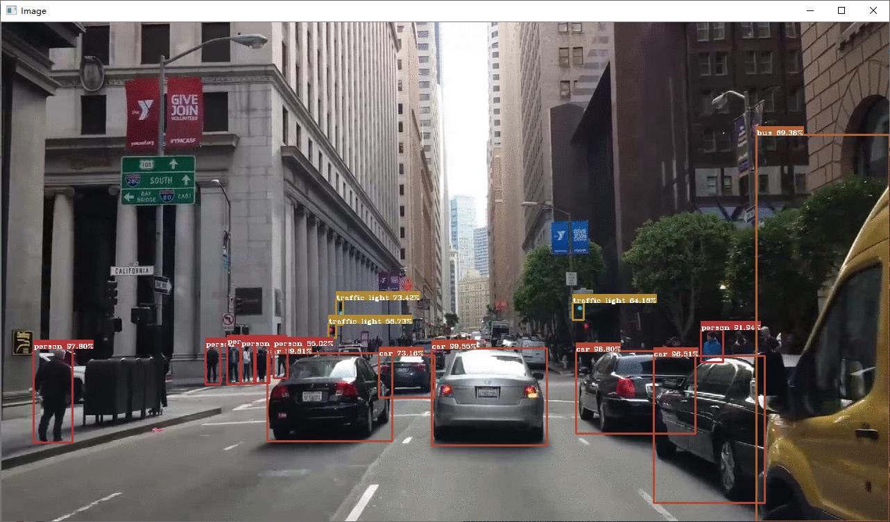
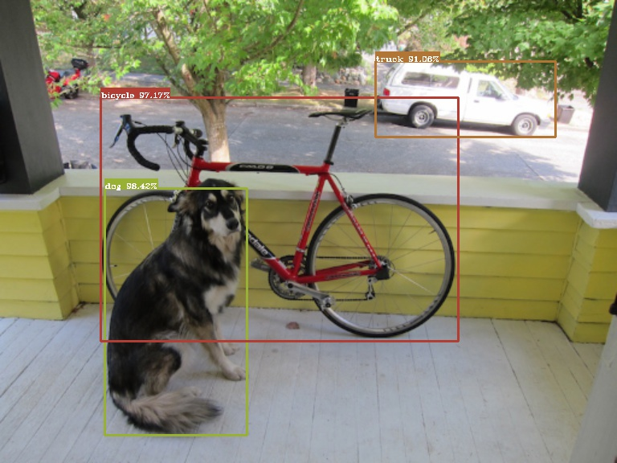

# More Than YOLO

TensorFlow & Keras & Python

YOLOv3, YOLOv3-tiny, YOLOv4, YOLOv4-tiny

[**非官方**]YOLOv4-tiny, YOLOX

**requirements:** TensorFlow 2.1 (not test on 1.x), OpenCV, Numpy, PyYAML

---

## 被训练支配的恐惧 !

- 因为目前可用的卡是一张游戏卡RTX 2070S(8 G)，因此在训练时使用了较小的batch，实际中尽量大batch可以省很多事。
- 本项目的数据增强均使用在线形式，高级的数据增强方式会大大拖慢训练速度。
- 训练过程中，Tiny版问题不大，而完整版模型容易NaN或者收敛慢，还在调参中。
- 增加了支持累计梯度的Adam优化器，类似darknet中subdivisions参数的作用。
- 在我训练yolov3以及yolov4时，我像往常一样将weight decay设为5e-4时，网络的结果总是那么不尽如人意，这一点困扰了我很久；当我把它调到0时，手里的奶茶又开始变香了。
- 在原始的tiny版本中，第一个anchor将不使用，这导致了大部分复现结果的差异。[[link]](https://github.com/hunglc007/tensorflow-yolov4-tflite/issues/111)
---

This repository have done:

- [x] Backbone for YOLO (YOLOv3, YOLOv3-tiny, YOLOv4, YOLOv4-tiny, Unofficial-YOLOv4-tiny)
- [x] YOLOv3 Head
- [x] Keras Callbacks for Online Evaluation
- [x] Load Official Weight File
- [x] Data Format Converter(COCO and Pascal VOC)
- [x] K-Means for Anchors
- [x] Fight with 'NaN'
- [x] Train (Strategy and Model Config)
  - Define simple training in [train.py](./train.py)
  - Use YAML as config file in [cfgs](./cfgs)
  - [x] Cosine Annealing LR
  - [x] Warm-up LR
  - [x] AccumOptimizer
- [ ] Data Augmentation
  - [x] Standard Method: Random Flip, Random Crop, Zoom, Random Grayscale, Random Distort, Rotate
  - [x] Hight Level: Cut Mix, Mix Up, Mosaic （These Online Augmentations is Slow）
  - [ ] More, I can be so much more ... 
- [ ] For Loss
  - [x] Label Smoothing
  - [x] Focal Loss
  - [x] L2, D-IoU, G-IoU, C-IoU
  - [ ] ...

---

[toc]

## 0. 在提问前直接看源码可更好帮助理解

相关的darknet权重可从官方渠道获取： https://github.com/AlexeyAB/darknet/releases 或者 https://pjreddie.com/darknet/yolo/.

## 1. Samples

### 1.1 Data File

本项目使用了不同于VOC和COCO的数据存储格式：

```txt
path/to/image1 x1,y1,x2,y2,label x1,y1,x2,y2,label 
path/to/image2 x1,y1,x2,y2,label 
...
```

当然本项目也提供了一个的[VOC格式转换脚本](./data/pascal_voc/voc_convert.py)和一个[COCO格式转换脚本](./data/coco/coco_convert.py)。

也可以从其他大佬的项目中看到这种格式的运用，甚至可以得到一个简单的入门级目标检测数据集： https://github.com/YunYang1994/yymnist.

### 1.2 Configure 

```yaml
# coco_yolov4.yaml
yolo:
  type: "yolov4"  # 当前只能是 'yolov3', 'yolov3_tiny', 'yolov4', 'yolov4_tiny' ‘unofficial_yolov4_tiny’ 和 'yolox'.
  iou_threshold: 0.5
  score_threshold: 0.005
  max_boxes: 100
  strides: "32,16,8"
  anchors: "12,16 19,36 40,28 36,75 76,55 72,146 142,110 192,243 459,401"
  mask: "6,7,8 3,4,5 0,1,2"
  name_path: "./data/coco/coco.name"

train:
  label: "coco_yolov4" # 决定了LOG的根目录名，比较随意
  anno_path: "./data/coco/train2017.txt"
  image_size: "320,352,384,416,448,480,512,544,576,608"  # 当设置为单一值时，比如"416"，表示使用单一图像训练尺度； 而"352,384,416,448,480" 则使用动态多尺度训练策略。

  batch_size: 4
  init_weight_path: "./ckpts/yolov4.weights" # 在载入权重前，你需要尽量保证网络结果一致，特别是darknet权重；而使用keras权重时，支持按层名导入。如果你想在官方COCO权重的基础上训练，可以直接使用COCO的网络配置，或者是先将darknet权重转为keras形式（只需向网络载入一次darknet权重，再保存权重就完成了转换）。
  save_weight_path: "./ckpts"

  loss_type: "CIoU+FL" # 支持 "L2", "DIoU", "GIoU", "CIoU"，或者以+分格的"L2+FL"开启Focal Loss
  
  # 一些策略的开关
  mosaic: false
  label_smoothing: false
  normal_method: true

  ignore_threshold: 0.7

test:
  anno_path: "./data/coco/val2017.txt"
  image_size: "608" # 验证模型时的图像尺寸
  batch_size: 1 # 占位，还不支持
  init_weight_path: "./ckpts/yolov4.weights"
```

### 1.3 K-Means

简单的编辑这一些超参，

```python
# kmeans.py
# Key Parameters
K = 6 # num of clusters
image_size = 416
dataset_path = './data/pascal_voc/train.txt'
```

### 1.4 Inference

#### 简单的面向图像、设备以及视频的测试脚本

目前只支持格式 mp4, avi, device id, rtsp, png, jpg (基于OpenCV) 



```shell
python detector.py --config=./cfgs/coco_yolov4.yaml --media=./misc/street.mp4 --gpu=false
```

#### YOLOv4的简单测试



```python
from core.utils import decode_cfg, load_weights
from core.model.one_stage.yolov4 import YOLOv4
from core.image import draw_bboxes, preprocess_image, postprocess_image, read_image, Shader

import numpy as np
import cv2
import time

# read config
cfg = decode_cfg('cfgs/coco_yolov4.yaml')
names = cfg['yolo']['names']

model, eval_model = YOLOv4(cfg)
eval_model.summary()

# assign colors for difference labels
shader = Shader(cfg['yolo']['num_classes'])

# load weights
load_weights(model, cfg['test']['init_weight_path'])

img_raw = read_image('./misc/dog.jpg')
img = preprocess_image(img_raw, (512, 512))
imgs = img[np.newaxis, ...]

tic = time.time()
boxes, scores, classes, valid_detections = eval_model.predict(imgs)
toc = time.time()
print((toc - tic)*1000, 'ms')

# for single image, batch size is 1
valid_boxes = boxes[0][:valid_detections[0]]
valid_score = scores[0][:valid_detections[0]]
valid_cls = classes[0][:valid_detections[0]]

img, valid_boxes = postprocess_image(img, img_raw.shape[1::-1], valid_boxes)
img = draw_bboxes(img, valid_boxes, valid_score, valid_cls, names, shader)

cv2.imshow('img', img[..., ::-1])
cv2.imwrite('./misc/dog_v4.jpg', img)
cv2.waitKey()
```

## 2. Train

!!! 请先阅读上一节的内容 (e.g. 1.1, 1.2).

```shell
python train.py --config=./cfgs/coco_yolov4.yaml
```

## 3. Experiment

### 3.1 Speed

**i7-9700F+16GB**

| Model       | 416x416 | 512x512 | 608x608 |
| ----------- | ------- | ------- | ------- |
| YOLOv3      | 219 ms  | 320 ms  | 429 ms  |
| YOLOv3-tiny | 49 ms   | 63 ms   | 78 ms   |
| YOLOv4      | 344 ms  | 490 ms  | 682 ms  |
| YOLOv4-tiny | 51 ms   | 66 ms   | 83 ms  |
| Unofficial-YOLOv4-tiny | 64 ms   | 86 ms   | 110 ms  |
| YOLOX | 67 ms | 83 ms | 104 ms |

**i7-9700F+16GB / RTX 2070S+8G**

| Model       | 416x416 | 512x512 | 608x608 |
| ----------- | ------- | ------- | ------- |
| YOLOv3      | 59 ms   | 66 ms   | 83 ms   |
| YOLOv3-tiny | 28 ms   | 30 ms   | 33 ms   |
| YOLOv4      | 73 ms   | 74 ms   | 91 ms   |
| YOLOv4-tiny | 30 ms   | 32 ms   | 35 ms  |
| Unofficial-YOLOv4-tiny | 30 ms   | 31 ms   | 34 ms   |
| YOLOx | 42 ms | 45 ms | 50 ms |

### 3.2 Logs

**Augmentations**

| Name                    | Abbr |
| ----------------------- | ---- |
| Standard Method         | SM   |
| Dynamic Mini Batch Size | DM   |
| Label Smoothing         | LS   |
| Focal Loss              | FL   |
| Mosaic                  | M    |
| Warm-up LR              | W    |
| Cosine Annealing LR     | CA   |

Standard Method Package 包括 Flip left and right,  Crop and Zoom(jitter=0.3), Grayscale, Distort, Rotate(angle=7).

**YOLOv3-tiny**(Pretrained on COCO; Trained on VOC)

| SM   | DM   | LS   | FL   | M    | Loss | AP   | AP@50 | AP@75 |
| ---- | ---- | ---- | ---- | ---- | ---- | ---- | ----- | ----- |
| ✔    |      |      |      |      | L2   | 26.6 | 61.8 | 17.2  |
| ✔    | ✔    |      |      |      | L2   | 27.3 | 62.4 | 17.9  |
| ✔    | ✔    | ✔    |      |      | L2   | 26.7 | 61.7  | 17.1 |
| ✔    | ✔    |      |      |      | CIoU | 30.9 | 64.2  | 25.0 |
| ✔    | ✔    |      | ✔    |      | CIoU | 32.3 | 65.7 | 27.6  |
| ✔    | ✔    |      | ✔    | ✔    | CIoU |  |  |  |

**YOLOv3**(TODO; Pretrained on COCO; Trained on VOC; only 15 epochs)

| SM   | DM   | LS   | FL   | M    | Loss | AP   | AP@50 | AP@75 |
| ---- | ---- | ---- | ---- | ---- | ---- | ---- | ----- | ----- |
| ✔    | ✔    |      | ✔    |      | CIoU | 46.5 | 80.0  | 49.0  |
| ✔    | ✔    |      | ✔    | ✔    | CIoU |      |       |       |

**YOLOv4-tiny**(TODO; Pretrained on COCO, part of YOLOv3-tiny weights; Trained on VOC)

| SM   | DM   | LS   | FL   | M    | Loss | AP   | AP@50 | AP@75 |
| ---- | ---- | ---- | ---- | ---- | ---- | ---- | ----- | ----- |
| ✔    | ✔    |      | ✔    |      | CIoU | 35.1 | 70.2 | 30.0 |
| ✔    | ✔    |      | ✔    | ✔    | CIoU |      |       |       |

**YOLOv4**(TODO; Pretrained on COCO;  Trained on VOC)

| SM   | DM   | LS   | FL   | M    | Loss | AP   | AP@50 | AP@75 |
| ---- | ---- | ---- | ---- | ---- | ---- | ---- | ----- | ----- |
| ✔    | ✔    |      | ✔    |      | CIoU |      |       |       |
| ✔    | ✔    |      | ✔    | ✔    | CIoU |      |       |       |

**Unofficial-YOLOv4-tiny**(TODO; Pretrained on COCO, part of YOLOv3-tiny weights; Trained on VOC)

| SM   | DM   | LS   | FL   | M    | Loss | AP   | AP@50 | AP@75 |
| ---- | ---- | ---- | ---- | ---- | ---- | ---- | ----- | ----- |
| ✔    | ✔    |      | ✔    |      | CIoU | 35.0 | 65.7  | 33.8  |
| ✔    | ✔    |      | ✔    | ✔    | CIoU |      |       |       |

**YOLOX**(TODO; Pretrained on COCO, part of YOLOv4-tiny weights; Trained on VOC)

| SM   | DM   | LS   | FL   | M    | Loss | AP   | AP@50 | AP@75 |
| ---- | ---- | ---- | ---- | ---- | ---- | ---- | ----- | ----- |
| ✔    | ✔    |      | ✔    |      | CIoU | 40.6 | 72.2  | 40.3  |
| ✔    | ✔    |      | ✔    | ✔    | CIoU |      |       |       |

### 3.3 训练细节

#### Tiny Version

| Stage | Freeze Backbone | LR                   | Steps   |
| ----- | --------------- | -------------------- | ------- |
| 0     | Yes             | 1e-3 (w/ W)          | 4000    |
| 1     | Yes             | -                    | 32*4000 |
| 2     | No              | 1e-3 to 1e-6 (w/ CA) | 48*4000 |

#### Common Version

| Stage | Freeze Backbone | LR                   | Steps    |
| ----- | --------------- | -------------------- | -------- |
| 0     | Yes             | 1e-3 (w/ W)          | 4000     |
| 1     | Yes             | -                    | 80*4000  |
| 2     | No              | 1e-3 to 1e-6 (w/ CA) | 120*4000 |

训练完整的网络实在太费时间。

## 4. Reference

- https://github.com/YunYang1994/TensorFlow2.0-Examples/tree/master/4-Object_Detection/YOLOV3
- https://github.com/hunglc007/tensorflow-yolov4-tflite
- https://github.com/experiencor/keras-yolo3

## 5. History

- Slim version: https://github.com/yuto3o/yolox/tree/slim
- Tensorflow2.0-YOLOv3: https://github.com/yuto3o/yolox/tree/yolov3-tf2
